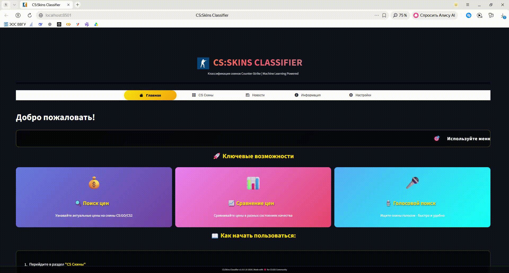

<div align="center">


# CS-SKINS-CLASSIFIER

</div>

<div align="center">


[](LICENSE)

</div>

## 📖 Описание
Система, написанная с применением алгоритмов машинного обучения, предназначенная для предсказания стоимости скинов Counter-Strike в качестве `Factory New` на основе табличных исторических данных.
Проект был разработан в качестве индивидуального проекта по предмету "Искусственный интеллект и глубокое обучение на Python". 

## 🛠 Используемые технологии

| Компонент | Библиотека | Версия |
|-----------|------------|--------|
| **Язык** | Python | `3.10` |
| **Frontend** | Streamlit | `1.57.0` |
| **Backend/API** | FastAPI | `0.136.1` |
| **ASGI-сервер** | Uvicorn | `0.47.0` |
| **ML-модель** | Scikit-learn | `1.7.2` |
| **Обработка данных** | Pandas / NumPy | `2.3.3` / `1.24.3` |
| **Визуализация** | Plotly | `6.7.0` |
| **Голосовой ввод** | SpeechRecognition | `3.16.1` |
| **HTTP-запросы** | Requests | `2.34.2` |
| **Формат данных** | JSON | встроенный |

## 📊 Обучающая и Тестовая выборка:
Обучающая выборка состоит из датасета `Cs_skins.csv`, содержащего информацию о тысячах скинов. Данные включают: название оружия, имя скина, редкость, тип кейса, состояние износа, наличие модификаций (StatTrak™) и исторические рыночные цены.

Для подготовки данных использовалась комплексная предобработка: заполнение пропущенных значений (`cs_imputer_rf.pkl`), приведение категориальных признаков к единому формату и маппинг колонок (`cs_columns_rf.pkl`). Выборка разделена на обучающую и тестовую в пропорции 80/20 для оценки обобщающей способности модели и предотвращения переобучения.

Пример структуры датасета:


Для улучшения точности модели в обучающую выборку были включены скины разных ценовых категорий: от бюджетных (`Consumer Grade`) до элитных (`Covert`, `Contraband`), а также учтены ценовые аномалии и сезонные колебания рынка.

## ⚙️ Схема работы программы:
Программа поделена на 3 логические части:

1. Клиентский интерфейс (Frontend на Streamlit);
2. REST API-сервер (Backend на FastAPI);
3. ML-модуль с предобученной моделью.

Первая часть отвечает за взаимодействие с пользователем: выбор оружия и скина через динамические списки, голосовой ввод через микрофон (`SpeechRecognition`), визуализация сравнения цен по состояниям износа и отображение статистики базы данных.

Далее, после выбора скина, интерфейс формирует HTTP-запрос и отправляет его на локальный API-сервер (`model_api.py`). Сервер принимает данные, применяет сохранённый пайплайн предобработки (импьютер + маппер колонок) и передаёт сформированный вектор признаков в модель.

После этого, набор чисел подаётся на вход ансамблевой модели регрессии. Модель делает предположение о рыночной стоимости скина в качестве `Factory New`.



На данный момент выходной слой модели возвращает непрерывное значение цены в долларах. Чем точнее подобраны гиперпараметры (количество деревьев, глубина разбиения, критерий ошибки), тем ниже метрики MAE и RMSE на тестовой выборке.

Порядок работы пайплайна следующий: 
`Raw Input (JSON) → Imputer → Column Mapper → RandomForest Regressor → Price Output`

## 📈 Дальнейшие улучшения

В дальнейшем не исключается возможность полной переработки модели на глубокую нейронную сеть (PyTorch/TensorFlow), а также интеграция с реальными API торговых площадок (Steam, Market.csgo) для получения онлайн-цен в реальном времени.

---

## 🚀 Установка и запуск

### 1. Клонируйте репозиторий и перейдите в папку:
```bash
git clone https://github.com/KonstantinMikhailovskiy/CS-SKINS-CLASSIFIER.git
cd CS-SKINS-CLASSIFIER
```
### 2. Создайте виртуальное окружение и установите зависимости:
```
python -m venv venv
venv\Scripts\activate   # Windows
pip install -r requirements.txt
```
### 3. Скачайте необходимые библиотеки
```
pip install streamlit==1.57.0
pip install fastapi==0.136.1
pip install uvicorn==0.47.0
pip install pandas==2.3.3
pip install scikit-learn==1.7.2
pip install numpy==1.24.3
pip install plotly==6.7.0
pip install speechrecognition==3.16.1
pip install pyaudio==0.2.14
pip install requests==2.34.2
pip install python-multipart==0.0.6
pip install streamlit_option_menu
pip install feedparser
pip install bs4
```
### 4. Запустите API-сервер с моделью:
```python model_api.py```
### 5. В новом окне терминала запустите веб-приложение:
```streamlit run Main.py```

## 📄 Лицензия

В данном проекте используется лицензия [MIT](https://github.com/KonstantinMikhailovskiy/CS-SKINS-CLASSIFIER/blob/main/LICENSE).
